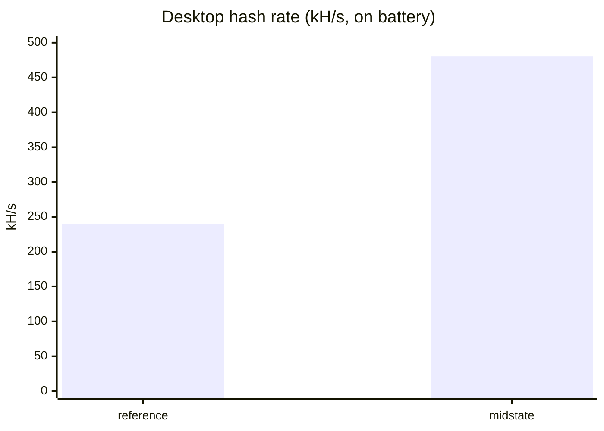
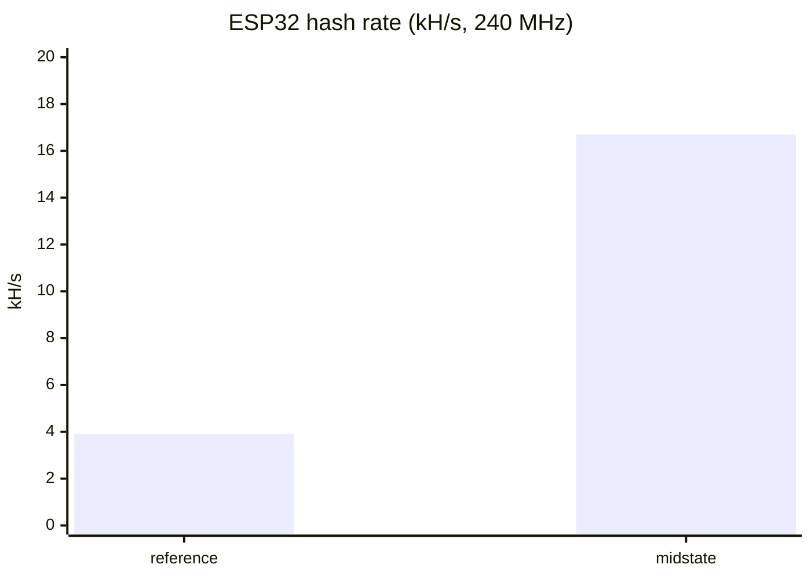

# ESP32 Bitcoin Miner

A from-scratch Bitcoin solo miner written in portable C, running both on a
desktop and on an ESP32 with the status shown over the serial console. It is a
learning project about how mining actually works end to end, not a machine meant
to make money.

> **Status: mining on both targets, with a real share accepted by the pool.**
> The same core code speaks Stratum v1, builds and verifies the coinbase,
> constructs the merkle root and block header with correct byte order, grinds the
> nonce with a SHA-256 midstate optimisation, and submits shares. It runs on a
> laptop (with gdb and a test bench) and, unchanged, on a bare ESP32 with a
> FreeRTOS task split. A 0.96" SSD1306 OLED status display and an isolated VLAN
> are the remaining planned steps.

## Why this exists

This is a deliberate learning exercise. At the hash rate of a small device
against a network of hundreds of exahashes per second, the expected time to
actually find a block is on the order of tens of billions of years, so finding
one is not a goal and never will be. The point is to understand every step of
proof-of-work by implementing it, rather than calling a library that hides it.

If the goal were ever a lottery ticket that statistically means something, the
answer would be a purpose-built ASIC (for example a Bitaxe), not a
microcontroller. That would be a different project.

## What's inside

Everything in the pipeline is implemented by hand, in clear C:

- **SHA-256 and double-SHA-256**, a readable reference implementation used as
  the correctness oracle, plus an optimised version that reuses the header
  **midstate** so only the second block is recomputed per nonce.
- **Merkle root construction** from the coinbase hash and the branch the pool
  sends, folded one level at a time.
- **Block header assembly**, the 80 bytes you hash, resolving Bitcoin's mixed
  endianness in one place (version and time reversed, previous-hash byte-swapped
  within each 32-bit word, nonce little-endian).
- **The Stratum v1 protocol**: subscribe, authorize, notify, set_difficulty,
  suggest_difficulty and submit, parsed and serialized without touching a socket
  so every message is unit-testable.
- **Coinbase construction and payout verification**: the miner searches for its
  own scriptPubKey inside the coinbase the pool builds, the only real proof that
  the block reward is paid to you and not to someone else.
- **Difficulty-to-target conversion**, so a share is checked locally before it
  is submitted.
- **A line-oriented TCP client** over BSD sockets, which the ESP32's lwIP stack
  offers identically, so the network code ports unchanged.
- **An ESP32 firmware** that brings up WiFi and runs the miner across two
  FreeRTOS tasks: the nonce grind pinned to core 1, WiFi and Stratum on core 0,
  with found shares handed over a queue.

## Architecture

The design rule is that the mining core is platform-independent C. The same
files compile for the host (with gcc and a test bench) and for the ESP32 (with
ESP-IDF). Nothing in `core/` knows what a socket or a display is.

```
core/                 portable C, compiles for host and ESP32
  sha256_ref.c/h      reference SHA-256 / double-SHA-256 (the oracle)
  sha256_fast.c/h     optimised SHA-256 with midstate reuse
  target.c/h          nBits expansion and target comparison (little-endian)
  merkle.c/h          merkle root from the coinbase hash and branch
  header.c/h          80-byte header assembly and byte order
  coinbase.c/h        coinbase assembly and payout (scriptPubKey) verification
  difficulty.c/h      share difficulty to target
  stratum_proto.c/h   Stratum v1 parse/serialize (no sockets)
platform/
  net_posix.c/h       line-oriented TCP client over BSD sockets
app_desktop/main.c    the desktop mining loop
app_esp32/            the ESP-IDF firmware (WiFi + FreeRTOS tasks)
test/                 one executable per module, run via CTest
third_party/cJSON/    vendored JSON parser (MIT), used on both targets
```

## Results

The pool honours `mining.suggest_difficulty`, so the share difficulty drops to 1
and the miner produces shares within reach. On the desktop, one was accepted:

```
>> share found: job 2dd1423 nonce 0282c702 extranonce2 0000000000000000
share ACCEPTED (id 100)
```

The midstate optimisation, measured on the same hardware and clock, roughly
doubled the desktop rate and more than quadrupled the ESP32:

| Target                 | Reference SHA-256 | With midstate | Speed-up |
|------------------------|------------------:|--------------:|---------:|
| Desktop (on battery)   |         240 kH/s  |     480 kH/s  |    2.0x  |
| ESP32 (240 MHz)        |         3.9 kH/s  |    16.7 kH/s  |    4.3x  |

On mains power in performance mode the desktop peaks around 800 kH/s.





## Getting started

Requirements for the desktop build: a C11 compiler, CMake 3.16 or newer, and
Make or Ninja. On Debian/Ubuntu/WSL:

```bash
sudo apt install build-essential cmake
```

Configure your pool and address. `config.h` is gitignored and never committed;
copy the template and fill in your own values:

```bash
cp config.example.h config.h
```

You need a Bitcoin address from your own wallet (a bech32 `bc1q...` address) and
its scriptPubKey (`0014` followed by the 20-byte key hash, which your wallet can
show). The device only ever knows this public address, never a private key. For
the ESP32 build the same file also holds the WiFi credentials.

Build and run the test bench, then the miner:

```bash
cmake -S . -B build
cmake --build build
ctest --test-dir build --output-on-failure
./build/miner_desktop
```

### On the ESP32

With [ESP-IDF](https://docs.espressif.com/projects/esp-idf/) installed and the
board connected, from the `app_esp32/` directory:

```bash
idf.py set-target esp32
idf.py build
idf.py -p /dev/ttyUSB0 flash monitor
```

The miner then joins WiFi, does the handshake, and grinds, logging the hash rate
and any accepted shares over the serial monitor.

## How it works

For each job the pool sends, the miner assembles the coinbase
(`coinb1 + extranonce1 + extranonce2 + coinb2`), double-hashes it into the merkle
leaf, folds the branch into the merkle root, and assembles the 80-byte header
once. Because the header's first 64 bytes are then fixed, their SHA-256 is
computed a single time into a midstate; each nonce only varies the last four
bytes, so only the second block is hashed in the inner loop. A hit is sent with
`mining.submit`.

## Testing

Every module has its own test executable, and the whole bench is built with
`-Wall -Wextra -Wpedantic -Werror`: on a project where bugs are silent, the
compiler is the cheapest reviewer available.

Two tests carry most of the weight. The **block 125552 golden test**
reconstructs the canonical worked example from its fields in Stratum format and
checks that the assembled header and its double-SHA-256 match the published
values byte for byte, which pins down every endianness decision. The **SHA-256
differential test** hashes tens of thousands of random headers through both the
reference and the optimised implementation and requires them to agree exactly,
so the fast path can never silently miss a valid hash.

## What this is not, and known limitations

- Not profitable, and not intended to be. See the odds above.
- The optimised SHA-256 is still plain C. Hand-written Xtensa assembly (a large
  further speed-up on the ESP32) is a possible next step, and the differential
  test is ready to validate it.
- A single device. Running several in parallel changes the odds from "never" to
  "never" and only adds complexity.
- No local Bitcoin node: work comes from a public solo pool over Stratum.
- The status display (a 0.96" SSD1306 OLED over I2C) and the isolated-VLAN
  network setup are still to come.

## Design decisions

A few choices are worth calling out, because making them deliberately is the
point:

- **C, not MicroPython.** An interpreter hides the very thing being learned, and
  the key optimisations live inside the hash function where Python cannot reach.
- **ESP-IDF, not Arduino.** IDF gives real C, real FreeRTOS and direct control,
  instead of a C++ layer that hides the internals.
- **One portable core.** `core/` has no platform dependencies, which is why the
  exact same files run under gdb on the desktop and on the ESP32 unchanged. The
  proof is that both targets mine from the same source.
- **cJSON, vendored.** A small, readable MIT parser, compiled from the same
  vendored copy on both targets, so the wire format ports for free while the
  mining core stays fully hand-written.
- **A bech32 (P2WPKH) address.** Its scriptPubKey has a short, recognisable
  pattern, which makes the coinbase payout easy to verify by eye.

## License

MIT. See [LICENSE](LICENSE).
